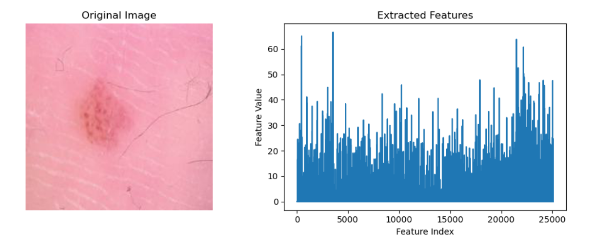
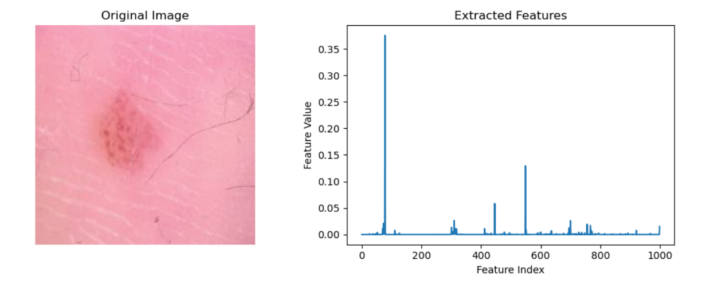
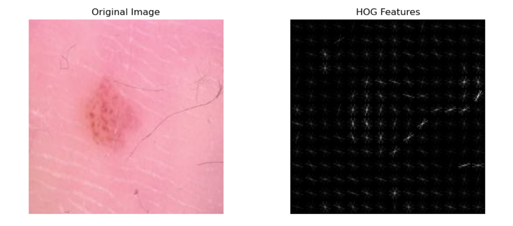

# Skin Disease Classification

## Dataset
The **HAM10000** (*Human Against Machine with 10,000 images*) dataset contains **10,015 dermatoscopic images** spanning **seven diagnostic classes**.

### Classes:
- **akiec**: Actinic keratoses and intraepithelial carcinoma – 327 images  
- **bcc**: Basal cell carcinoma – 514 images  
- **bkl**: Benign keratosis – 1,099 images  
- **df**: Dermatofibroma – 115 images  
- **mel**: Melanoma – 1,113 images  
- **nv**: Melanocytic nevi – 6,705 images  
- **vasc**: Vascular lesions – 142 images  

> **Note:** The dataset is **highly imbalanced**, with the "nv" class dominating, which introduces classification bias.

---

## Data Augmentation and Undersampling

To address class imbalance, the **four smallest classes** (`akiec`, `bcc`, `df`, `vasc`) were:
- **Augmented** using:
  - Rotation (±10°)
  - Width shift: 0.1
  - Height shift: 0.1
  - Shear: 0.2
  - Zoom: 0.2
  - Brightness range: 0.8–1.2
  - Horizontal & vertical flips
- **Undersampled** to ensure each class has **800 images**

### Class Distribution Before and After

  
  

> All images were resized to **224×224** pixels.

---

## Feature Extraction

Three types of feature extractors were applied:

- **VGG16** (Visual Geometry Group 16)

  

- **ResNet50** (Residual Network, 50 layers)

  

- **HOG** (Histogram of Oriented Gradients)

  

---

## Classification

Each feature set was evaluated using the following classifiers:
- **SVM** (Support Vector Machine)
- **RFC** (Random Forest Classifier)
- **LRC** (Logistic Regression Classifier)

---

## Results

| Feature Extraction | SVM  | RFC  | LRC  |
|--------------------|------|------|------|
| VGG16              | 83%  | 78%  | 84%  |
| ResNet50           | 86%  | 82%  | 85%  |
| HOG                | 65%  | 69%  | 55%  |

> **Observation:** ResNet50 with SVM achieved the highest accuracy (86%), while HOG with Logistic Regression showed the lowest (55%).

